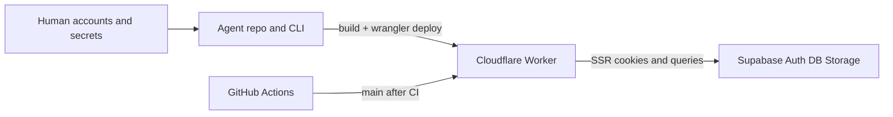

---

## change_id: deployment

status: in-progress
created: 2026-09-07
project: watch-bldrs
recommended_platform: Cloudflare Workers
sources:

- context/foundation/infrastructure.md
- context/foundation/tech-stack.md

# Cloudflare Workers integration and deployment

WatchBldrs is already a Cloudflare **Workers** app (`output: "server"`, `@astrojs/cloudflare` v14, `wrangler.jsonc`). Never run `wrangler pages deploy` or `npx astro add cloudflare`.

**Correct the stale foundation hint.** In `context/foundation/tech-stack.md` change `deployment_target: cloudflare-pages` to `deployment_target: cloudflare-workers`, and rewrite the “Why this stack” sentence that still says Pages is the deploy target. Keep `ci_provider: github-actions` and `ci_default_flow: auto-deploy-on-merge`. `context/foundation/infrastructure.md` already records the Pages hint as stale; after this edit, tech-stack and infrastructure agree.

Target for MVP: `https://watch-bldrs.contact-tofucode.workers.dev`. Custom domain is optional later. GitHub Actions stays the CI provider; auto-deploy-on-merge runs after CI on push to `main`.




Do **not** enable Cloudflare dashboard “Workers Builds” (Git-connected) in parallel with GitHub Actions — that double-deploys.

## Progress

- [x] Phase 1 — Agent: repo hardening (no Cloudflare login required)
- [x] CLI + Supabase configuration (Wrangler login, hosted project link, env files)
- [x] Phase 2 — Human: accounts, login, secrets
- [x] Phase 3 — Agent + human: first production deploy and verify
- [x] Phase 4 — Agent: docs and ops cookbook (committed)
- [x] Phase 5 — Agent: auto-deploy on merge to `main`

## Manual accounts and services

A human must complete these before the agent can deploy. Do not let the agent delete the Worker or the Supabase project.

- **Cloudflare account** — [dash.cloudflare.com](https://dash.cloudflare.com), email verified.
- **Workers Free plan** — sufficient to start. Upgrade to **Workers Paid ($5/month)** if SSR + Supabase exceeds the **10 ms CPU / invocation** Free cap (still the real paid trigger; bundle size is 64 MiB uncompressed on both plans as of 2026-09-04).
- **workers.dev subdomain** — Workers & Pages → Settings → `*.workers.dev` subdomain. First `wrangler deploy` may prompt to create it. If the URL returns **523**, wait ~1 minute (Cloudflare first-publish DNS).
- **Interactive login** — from the repo: `npx wrangler login`, then `npx wrangler whoami` (OAuth; the agent cannot finish this unattended).
- **Hosted Supabase project** — [supabase.com](https://supabase.com). Region close to the primary audience (EU / Frankfurt if users are in Poland). Local Docker Supabase is **not** the production data plane.
- **Supabase Auth URL config** — Authentication → URL Configuration:
  - Site URL = `https://watch-bldrs.<subdomain>.workers.dev` (no trailing slash)
  - Additional Redirect URLs: that origin plus `http://localhost:4321/**` (or the actual `astro dev` origin)
- **Supabase email confirm** — leave confirmation **on** for production; confirmation links use Site URL. If they still point at localhost, signup “works” locally and fails in production.
- **Supabase Storage CORS** (when browser uploads land): allow the `workers.dev` origin (and later the custom domain). Not required for the first HTML-only deploy.
- **GitHub repository** — Settings → Secrets and variables → Actions, for CI build + later deploy tokens.
- **Optional later:** custom domain on a Cloudflare zone; Google/Reddit OAuth (PRD); Cloudflare Turnstile (`docs/OPERATIONAL_SAFETY.md` §7); Paid Workers.

Do **not** create: Cloudflare Pages project, D1, R2, Hyperdrive, Cloudflare Images pipeline, or a second Git deploy integration.

## Secrets inventory

Two stores. Mixing them is the pre-mortem failure (empty catalog + silent login fail).

**Local (gitignored):** `.dev.vars` and `.env` from `.env.example`

**GitHub Actions (build only — never reach the Worker):**

- `SUPABASE_URL` — `https://<project-ref>.supabase.co`
- `SUPABASE_KEY` — **anon / publishable** key only. Never the `service_role` key.

**Cloudflare Worker runtime (**`npx wrangler secret put` **— write-only;** `wrangler secret list` **shows names only):**

- `SUPABASE_URL` — same hosted URL
- `SUPABASE_KEY` — same **anon** key

**GitHub Actions (auto-deploy phase only):**

- `CLOUDFLARE_API_TOKEN` — Dashboard → My Profile → API Tokens → template **Edit Cloudflare Workers**, scoped to this account
- `CLOUDFLARE_ACCOUNT_ID` — from `npx wrangler whoami` or the dashboard

Never commit secrets, never log them, never put them in `wrangler.jsonc` `vars`. Do not add `account_id` to git unless you explicitly want it there; CI can use `CLOUDFLARE_ACCOUNT_ID`.

## How to configure the CLIs

Use the versions already in this repo: Node **22.14.0** (`.nvmrc`), `wrangler` and `supabase` from `package.json` via `npx` (do not install global CLIs unless you must). On Windows, run these from the repo root in PowerShell. `npx wrangler login` and `npx supabase login` open a browser; the agent cannot finish OAuth unattended.

### Wrangler (Cloudflare Workers)

Do **not** run `npx wrangler init` or `npx astro add cloudflare`. The Worker config already exists.

- [x] Node 22.14.0 is active (`node -v`).
- [x] `npm install` has been run so local Wrangler is available.
- [x] Log in and confirm the account:

```bash
npx wrangler login
npx wrangler whoami
```

Copy **Account ID** from `whoami` (needed later for GitHub `CLOUDFLARE_ACCOUNT_ID`). If login fails in a headless/remote session, create an API token (Edit Cloudflare Workers) and use it only in that shell — never commit it:

```powershell
$env:CLOUDFLARE_API_TOKEN = "<token>"
npx wrangler whoami
```

- [x] After the Worker exists, set runtime secrets (values are write-only):

```bash
npx wrangler secret put SUPABASE_URL
npx wrangler secret put SUPABASE_KEY
npx wrangler secret list
```

Useful checks (do not make `wrangler dev` the daily loop — `npm run dev` already uses workerd):

```bash
npx wrangler deploy --dry-run
npx wrangler tail --status error --format json
```

### Supabase CLI

`supabase/` already exists (`config.toml`). Do **not** run `npx supabase init`. Local Docker is for development only; production must be a **hosted** project.

#### Local stack (optional, Docker required)

- [x] Docker Desktop is running (~7 GB RAM on first pull).
- [x] Start and copy the printed **anon** key (not `service_role`) into `.env` and `.dev.vars`:

```bash
cp .env.example .env
cp .env.example .dev.vars
npx supabase start
```

Typical local values:

```
SUPABASE_URL=http://127.0.0.1:54321
SUPABASE_KEY=<anon key from CLI output>
```

Studio: `http://localhost:54323`. Stop with `npx supabase stop`.

Local Auth in `supabase/config.toml` currently has `site_url = "http://127.0.0.1:3000"` and `enable_confirmations = false`. Astro’s default origin is **4321**. For local magic-link/confirm later, set:

```toml
site_url = "http://127.0.0.1:4321"
additional_redirect_urls = ["http://127.0.0.1:4321/**"]
```

Leave confirmations **off** locally if you want sign-in without mail; production hosted Auth must keep confirmations **on**.

#### Hosted project (required for Workers)

Human-only. Create the project in the [Supabase dashboard](https://supabase.com/dashboard) first (region close to the audience, e.g. `eu-central-1` / Frankfurt).

- [x] Log in and link this repo (do not re-init):

```bash
npx supabase login
npx supabase link --project-ref <project-ref>
npx supabase projects list
```

`<project-ref>` is the subdomain of `https://<project-ref>.supabase.co`. Link writes `.supabase` locally (gitignored). Optional: rename `project_id` in `supabase/config.toml` from `10x-astro-starter` to `watch-bldrs` so local/remote names match.

- [x] Read API keys from **Settings → API** (or CLI). Put the **Project URL** and **anon public** key into `.env` and `.dev.vars`. Never put `service_role` in Wrangler, GitHub Actions, or client code.

```
SUPABASE_URL=https://<project-ref>.supabase.co
SUPABASE_KEY=<anon-or-publishable-key>
```

- [x] Auth URL Configuration (dashboard — hosted only; `config.toml` does not push these):
  - Site URL = `https://watch-bldrs.<workers-subdomain>.workers.dev` (no trailing slash; set after first deploy if the URL is not known yet)
  - Redirect URLs: that origin `/**` plus `http://127.0.0.1:4321/**`
  - Email confirmations: **on** for production
- [ ] When schema migrations exist: `npx supabase db push` (or dashboard SQL). There is no `supabase/migrations/` yet; do not invent a push. Rollback of the Worker does **not** undo a `db push`.
- [ ] Storage CORS: add the workers.dev origin when browser uploads exist (not required for the first HTML-only deploy).

GitHub build secrets (same hosted URL + anon key, not `service_role`):

```bash
gh secret set SUPABASE_URL
gh secret set SUPABASE_KEY
```

Or paste them in GitHub → Settings → Secrets and variables → Actions.

## Phase 1 — Agent: repo hardening (no Cloudflare login required)

Worker `name` is already `watch-bldrs` in `wrangler.jsonc`. Package name is still `10x-astro-starter`.

- [x] Rename `"name"` in `package.json` to `watch-bldrs`.
- [x] Keep `main`: `@astrojs/cloudflare/entrypoints/server`, `compatibility_date`: `2026-05-08`, `compatibility_flags`: `["nodejs_compat"]` (flag is default only for dates ≥ 2026-08-04).
- [x] Set `preview_urls: false` (Wrangler 4.129 enables previews by default when unset; drafts must not leak on public `workers.dev` URLs).
- [x] Declare required runtime secrets so a deploy without them fails instead of shipping a dead auth client:

```jsonc
"secrets": { "required": ["SUPABASE_URL", "SUPABASE_KEY"] }
```

- [x] In `astro.config.mjs`: `adapter: cloudflare({ imageService: "compile" })` and top-level `session: false` (Astro 7.2+ opt-out; not an adapter option). Catalog photos stay on Supabase Storage (avoid the default Images binding quota). This app does not use Astro sessions (cookies + `@supabase/ssr` only), so skip auto-provisioned SESSION KV.
- [x] Add scripts: `"deploy": "astro build && wrangler deploy"`, keep `dev` / `preview` as the workerd loop (do **not** add a parallel `wrangler dev`).
- [x] After the first live URL exists, set `site` in `astro.config.mjs` so `@astrojs/sitemap` has an origin.
- [x] Update `context/foundation/tech-stack.md`: `deployment_target: cloudflare-workers` plus the matching prose (Workers, `wrangler deploy`, not Pages).
- [x] Write `docs/deployment.md` with the command cookbook below; replace the starter Deployment / CI sections in `README.md`. Point AGENTS.md CI note at the new deploy job when Phase 5 lands.

## Phase 2 — Human: accounts, login, secrets

Agent stops and waits. Follow **How to configure the CLIs** above.

- [x] Create Cloudflare + hosted Supabase accounts (region as above).
- [x] Wrangler: `npx wrangler login` → `npx wrangler whoami`.
- [x] Supabase CLI: `npx supabase login` → `npx supabase link --project-ref <project-ref>`.
- [x] Copy hosted `SUPABASE_URL` + anon key into local `.dev.vars` / `.env` (not `service_role`).
- [x] Put **runtime** secrets on Worker `watch-bldrs`. If `secret put` fails because the Worker does not exist yet, skip `secrets.required` for one bootstrap deploy, put secrets, restore `secrets.required`, deploy again.
- [x] Set GitHub Actions `SUPABASE_URL` / `SUPABASE_KEY` (build only).
- [x] Set hosted Auth Site URL + redirect URLs to the workers.dev origin (second pass after Phase 3 prints the URL).

## Phase 3 — Agent + human: first production deploy and verify

Local production-like check (already workerd):

```bash
npm run build
npm run preview
```

Deploy (never `wrangler pages deploy`, never `wrangler deploy --env` with this adapter):

```bash
npm run build
npx wrangler deploy
```

- [x] Confirm the printed `https://watch-bldrs.contact-tofucode.workers.dev` URL.
- [x] Smoke: home renders; sign-up/sign-in sets a session cookie and `/dashboard` stays authenticated after refresh; missing runtime secrets must not silently look “up”.
- [ ] Tail CPU on the first authenticated page (optional; upgrade to Workers Paid if invocations exceed ~10 ms).

```bash
npx wrangler tail --status error --format json
npx wrangler versions list
```

If invocations exceed ~10 ms CPU, enable **Workers Paid** ($5/mo) in the dashboard. Do not treat Free as a guarantee for SSR + Auth + DB.

## Phase 4 — Agent: docs and ops cookbook (committed)

- [x] Publish the commands below in `docs/deployment.md`. Include: Workers not Pages; build secrets ≠ runtime secrets; rollback does not undo Supabase migrations or secret puts.

**Deploy / rollback / logs**

```bash
npm run build && npx wrangler deploy
npx wrangler versions list
npx wrangler rollback
npx wrangler rollback <VERSION_ID>
npx wrangler tail
npx wrangler tail --status error --format json
```

**Rotate a secret** (put a new value; list never shows values):

```bash
npx wrangler secret put SUPABASE_URL
npx wrangler secret put SUPABASE_KEY
```

**If Wrangler environments are added later** (not for MVP):

```bash
CLOUDFLARE_ENV=<env> npx astro build && npx wrangler deploy
```

Wrong: `npx wrangler deploy --env <env>` ([withastro/astro#16040](https://github.com/withastro/astro/issues/16040)).

## Phase 5 — Agent: auto-deploy on merge to `main`

Only after Phase 3 works. Matches tech-stack `ci_provider: github-actions` + `ci_default_flow: auto-deploy-on-merge`.

- [x] Human adds `CLOUDFLARE_API_TOKEN` and `CLOUDFLARE_ACCOUNT_ID` to GitHub.
- [x] Agent extends `.github/workflows/ci.yml`:
  - Keep lint / test / build on PRs and `main`.
  - Add a `deploy` job: `needs: ci`, `if: github.ref == 'refs/heads/main' && github.event_name == 'push'`.
  - Build with the existing `SUPABASE_*` GitHub secrets, then `cloudflare/wrangler-action@v4` (or `npx wrangler deploy` with the same env). Do not pass production Worker secrets as GitHub env expecting them to appear on the Worker — they already live in Cloudflare.
  - `pull_request` from forks must not receive deploy tokens (job gated to `push` on `main`).
  - Do not publish preview URLs in this MVP.

## External integrations (do / don’t)

- **Cloudflare Workers** — SSR, cookies, Actions, assets. Deploy here.
- **Cloudflare Pages** — stale starter target. Never.
- **Supabase Auth / Postgres / Storage** — identity, data, main photo. Hosted project + anon key + RLS.
- **GitHub Actions** — lint/test/build, later deploy. Token-scoped to this account.
- **Cloudflare Images / KV sessions** — adapter defaults. Disable via `imageService: "compile"` and `session: false`.
- **Hyperdrive / D1** — not in stack. Skip.

Auth is cookie-based `src/lib/supabase.ts` + `src/middleware.ts`. Production origin must be HTTPS (`workers.dev` is). When PRD magic-link / OAuth is added, extend Supabase Redirect URLs and keep Site URL on the live origin.

Cache: never “Cache Everything” on cookie routes (`docs/OPERATIONAL_SAFETY.md` §5).

## Edge-case playbook (extra support)

- `npx supabase init` **on an existing repo:** `supabase/config.toml` is already here. Re-init overwrites local Auth/DB settings. Use `login` + `link` only.
- **Local Auth vs hosted Auth:** `config.toml` applies to Docker (`npx supabase start`). Hosted Site URL / redirects are dashboard-only unless you use a documented config-sync flow. Setting `site_url` in git does not change production Auth.
- **Wrong local port:** starter `site_url` is port **3000**; Astro is **4321**. Confirm-email / magic-link locally will bounce until `config.toml` matches.
- `service_role` **in Wrangler or GitHub:** bypasses RLS. Use **anon** only; authorization stays in policies + server session.
- **Docker not running:** `npx supabase start` fails. Production deploy does not need Docker if `.dev.vars` uses the hosted URL.
- `secrets.required` **vs first deploy:** `wrangler secret put` may need an existing Worker. Bootstrap: deploy once without `secrets.required`, put secrets, restore the required list, deploy again.
- **Login works locally, not on workers.dev:** runtime secrets missing or still localhost; Site URL still `localhost`; email confirm links wrong host. Fix Cloudflare secrets + Supabase URL config, then retry. Do not assume GitHub build secrets populated the Worker.
- **523 on first URL:** wait ~1 minute for workers.dev DNS.
- **React islands dead / like button no-op:** on a **custom domain zone**, disable Rocket Loader, Auto Minify (deprecated but still on old zones), Email Obfuscation. `workers.dev` has no zone minify; if hydration fails there, it is a bundle/runtime bug, not Auto Minify.
- **Error 1102 / CPU exceeded:** upgrade to Workers Paid; sequence Auth + DB + Storage (max **6** concurrent outbound connections per request). Measure with `wrangler tail` / Observability (already `observability.enabled` in wrangler).
- **High latency, Worker healthy:** edge HTML vs single-region Supabase. Move the Supabase project closer; keep catalog queries small.
- `workerd` **vs Node:** develop with `npm run dev` (already workerd). Do not add Node-only server deps. Keep `nodejs_compat`.
- `Invalid URL string` **/ Worker won’t boot:** Astro 7 minify + unsubstituted `@@ASTRO_MANIFEST_REPLACE@@` ([withastro/astro#17844](https://github.com/withastro/astro/pull/17844)). Check `dist` for leftover placeholders; upgrade Astro/`@astrojs/cloudflare` before inventing a minify workaround.
- **Bundle / startup:** 64 MiB uncompressed (`Total Upload` from `npx wrangler deploy --dry-run`); 128 MB memory; 1 s startup still apply. Paid is for CPU, not bundle size.
- **Rollback:** `npx wrangler rollback` last 100 versions only; does **not** undo DB migrations, Storage, or secret changes. Durable Object migrations N/A.
- `*.supabase.co` **blocked (e.g. some ISPs):** optional later reverse-proxy; not MVP. SSR still talks Supabase from Cloudflare’s network.
- **Custom domain (optional):** attach domain; update `site`, Supabase Site URL / redirects / Storage CORS; disable zone Rocket Loader / minify / obfuscation; do not Cache Everything; never use Pages.

## Out of scope this pass

Product features (catalog, likes, magic link). Wrangler bump to ≥ 4.102 for `--temporary`. Cloudflare Access in front of previews. Multi-environment (`staging` / `production`) wrangler `env` blocks.