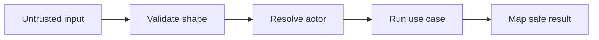

# Security Model

Operational rules: @AGENTS.md.

## RLS Authorization Matrix

RLS policies and grants are part of the architecture, not an implementation afterthought.

| Resource and operation | Anonymous | Authenticated non-author | Author |
| --- | --- | --- | --- |
| Select published build | Allow | Allow | Allow |
| Select draft build | Deny | Deny | Allow |
| Insert build | Deny | Own row only | Own row only |
| Update build | Deny | Deny | Allow |
| Publish build | Deny | Deny | Allow (`draft` → `published`) |
| Delete build | Deny | Deny | Allow |
| Select parts of published build | Allow | Allow | Allow |
| Select parts of draft | Deny | Deny | Allow |
| Mutate parts | Deny | Deny | Allow for owned parent |
| Select likes/count | Allow | Allow | Allow |
| Insert like | Deny | Own like on published build | Own like on published build |
| Delete like | Deny | Own like only | Own like only |

Test policies with at least three identities:

- anonymous;
- author A;
- different authenticated user B.

Tests must call the data boundary as those identities. Testing only application code does not prove RLS correctness. See @context/foundation/architecture/testing.md.

## Publication State Machine

```mermaid
stateDiagram-v2
    [*] --> Draft: create
    Draft --> Draft: edit
    Draft --> Published: publish
    Draft --> [*]: delete
    Published --> Published: edit
    Published --> Draft: unpublish (SQL; no MVP UI)
    Published --> [*]: delete
```

The MVP UI does not expose unpublish. The database allows `published -> draft` so a later slice can add the control without a schema change. `published_at` is set on first publish and is not cleared or overwritten.

Enforce publication at multiple levels:

1. Domain/application and UI omit an unpublish control in the MVP (S-02). Do not add a dedicated unpublish Action until a later slice.
2. The database allows `published -> draft`. Do not add a trigger that forbids the reverse.
3. RLS verifies ownership for every mutation. After unpublish, draft SELECT/Storage rules apply again.

## Main Image and Storage Strategy

Draft image privacy makes a fully public bucket unsafe.

Recommended MVP approach:

1. Store all build images in a private bucket.
2. Use object paths scoped by verified author and build, for example `USER_ID/BUILD_ID/main.ext`.
3. Allow the author to upload, replace, and delete objects for their own builds.
4. Generate time-limited signed read URLs for catalog/details output after verifying that the build is published.
5. Generate author-only signed URLs for draft management.
6. Store only the object path in `builds.main_image_path`, never a temporary signed URL.

If a later implementation moves published files into a public bucket, publication and file movement must run in one transaction or use compensating rollback. If that is not achievable in the MVP, keep the private-bucket strategy above.

Image validation should include allowed media type, size limit, and safe generated object names. Never trust the original filename as an authorization boundary.

## Astro Actions and BFF Boundary

Astro on Cloudflare Workers acts as the application's BFF. The BFF is part of the same repository; it is still server-side code.

Recommended Actions: `actions.builds.createDraft`, `actions.builds.update`, `actions.builds.publish`, `actions.builds.delete`, `actions.likes.like`, `actions.likes.unlike`.

`src/actions/index.ts` is only a registry that imports grouped actions from each module's `server.ts` entrypoint. See incremental adoption in @AGENTS.md.

Every Action follows the same pipeline:

Actions must not trust an `authorId`, `userId`, role, build owner, or publication state supplied by the browser. Actor identity comes from the verified server-side session.

## Authentication and Request Context

@src/middleware.ts is responsible for cross-cutting request setup:

- create or expose the request-scoped Supabase client;
- verify/refresh the cookie-backed session according to the existing auth implementation;
- store a minimal current-actor representation in `Astro.locals`;
- avoid feature-specific authorization decisions.

Suggested actor contract: `@src/types.ts` (`Actor`).

Feature authorization remains in the relevant use case and database policy. UI route guards improve user experience but do not replace RLS.

## CI verification exception

OPERATIONAL_SAFETY §16 record for F-01 (and later RLS/schema changes until CI can start local Supabase). SQL unpublish is the product contract in the publication state machine above, not an exception.

1. **Rules bypassed:** §1 “CI should fail when committed generated database types do not match the migrated schema”; §15 “generated database types match the migrated schema (CI should fail on mismatch)”; §15 “RLS and Storage policies are tested as anonymous, author, and non-author” as a GitHub Actions job.
2. **Why the normal approach is unsuitable:** GitHub Actions does not run Docker / `npx supabase start`. Adding that would require a CI service-role secret or embedding local keys. Hosted RLS tests would need a dedicated project. F-01 keeps CI as lint, unit tests, and build.
3. **Impact:** An RLS, Storage, or typegen regression can reach `main` if the author skips local commands. Draft privacy is not proven on the CI runner.
4. **Compensating controls:** For schema, RLS, or Storage policy changes, `npm run db:types` (committed `src/lib/database.types.ts`) and `npm run test:integration` against local Docker Supabase are merge gates (@AGENTS.md Definition of Done). The service role is not in GitHub secrets or the Worker. Hosted `npx supabase db push` stays a separate operator step from Worker deploy.
5. **Temporary:** Yes, until CI can run local Supabase without a production service-role secret.
6. **Recorded:** this section; OPERATIONAL_SAFETY §15 pointer; AGENTS.md Definition of Done.
