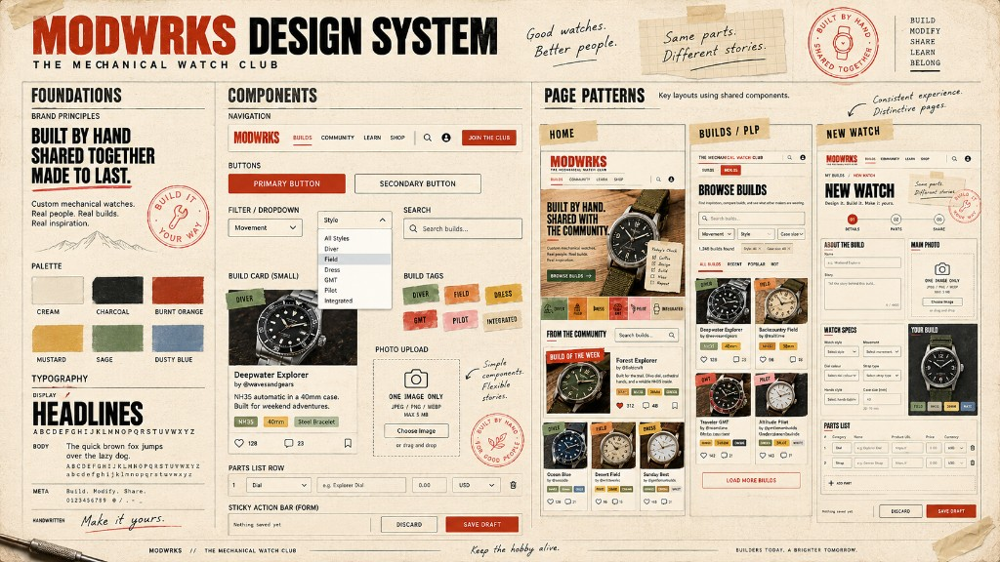

# Design system visual

Paper-and-ink visual language for WatchBldrs UI. This board is the look-and-feel reference across UI-kit slices (authoring form, photo upload, listing, filters, home). It is not a product-scope document — `prd.md` still wins on what to build.

The board uses the fictional name **MODWRKS**. The product name remains **WatchBldrs**. Use the palette, type, stamps, and component shapes; do not rename the app.

Implemented tokens already live in `src/styles/global.css` (cream paper, charcoal, burnt orange / primary, mustard, sage / olive, dusty blue). Prefer those tokens over inventing a second palette.

## How to use it

| Board region | Owns the look | Roadmap slice that implements it |
| --- | --- | --- |
| Field, select, parts row, sticky save bar | Authoring form widgets | F-02 `authoring-form-components` |
| Photo upload well | Main-photo control | F-03 `photo-upload-component` |
| Build card, tags, listing buttons | Listing kit | F-04 `listing-ui-components` |
| Filter / dropdown | Filter kit | F-05 `filter-ui-components` |
| Home, listing page, new-watch page patterns | Page composition | F-06 / S-02 / S-04 / S-10 |

A tighter Build Form mockup for F-02 lives at `context/changes/authoring-form-components/build-form-reference.png`.
