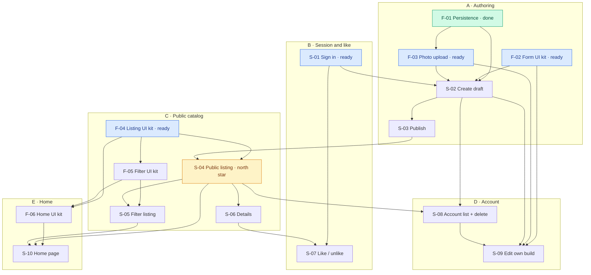

# Roadmap: WatchBldrs

> Derived from `prd.md` (v1) + auto-researched codebase baseline + the open-milestone re-decomposition of 2026-09-11.
> Edit-in-place; archive when superseded.
> Slices below are listed in dependency order. The "At a glance" table is the index.

## Milestone

**M-1: Proving flow — publish and discover** — Status: open

- **Intent:** Deliver the primary success criterion: an enthusiast can sign in, create a structured draft, publish it, and another person can browse and filter it; an authenticated user can like it. Sequence for speed — park anything not on that path.
- **Source materials:** `context/foundation/prd.md` (v1)
- **Done when:** every F-NN and S-NN below is `done`.
- **Scope anchors:** FR-001–FR-010, US-01–US-07, Access Control, Non-Functional Requirements (phone and desktop; sign-in must not block a first publish).

## Vision recap

Custom-watch builds already exist on forums and Reddit, but they are hard to find and filter, and details like parts and prices are often missing. Structured attributes beat mixed threads. WatchBldrs is a dedicated place to present a finished build and to scan other people’s builds for parts, prices, and inspiration.

## North star

**S-04: user can browse published builds on the public listing** — this is the first proving story (the smallest end-to-end delivery that would prove the product’s core claim: a structured build belongs in a dedicated catalog). Create and publish come immediately before so the listing is not empty; details and filters stay separate so this slice is not the whole flow.

> Here, **north star** means the smallest end-to-end slice whose successful delivery would prove that core claim — placed as early as Prerequisites allow because everything else only matters if this works.

## At a glance

| ID | Change ID | Outcome (user can …) | Prerequisites | PRD refs | Status |
|---|---|---|---|---|---|
| F-01 | build-visibility-and-storage | (foundation) builds and parts persist with author ownership, author-only drafts, SQL-allowed unpublish (no MVP UI), and private main-image storage | — | Access Control; Success Criteria guardrails; FR-003, FR-004 | done |
| F-02 | authoring-form-components | (foundation) every UI component needed to implement the authoring form is in the shared UI library (photo upload is F-03) | — | FR-004, FR-005 | done |
| F-03 | photo-upload-component | (foundation) a photo-upload component and its upload logic can attach one main photo to private storage | F-01 | FR-004 | ready |
| S-01 | sign-in-and-session | user can register, log in, and log out without extra profile fields; create, edit, and like stay gated after logout | — | US-01, FR-001 | ready |
| S-02 | create-draft-build | user can create a draft build with watch attributes, parts list, and main photo; the draft stays private | F-01, F-02, F-03, S-01 | US-02, FR-003, FR-004, FR-005 | proposed |
| S-03 | publish-draft-build | user can publish a draft they own so it is eligible for the public listing | S-02 | US-02, FR-004 | proposed |
| F-04 | listing-ui-components | (foundation) listing Cards, Labels, Badges, Tags, and Buttons are in the shared UI library | — | FR-002 | ready |
| S-04 | show-public-builds | user can browse published builds on the public listing with pagination or infinite scroll; drafts stay hidden | F-04, S-03 | US-02, FR-002 | proposed |
| F-05 | filter-ui-components | (foundation) filter components that attach to an existing listing are in the shared UI library | F-04 | FR-006 | proposed |
| S-05 | filter-published-listing | user can filter the published listing by watch style, movement, dial colour, strap type, and case size with AND semantics, without breaking existing pagination | F-05, S-04 | US-03, FR-002, FR-006 | proposed |
| S-06 | view-published-details | user can open a published build’s details and see main photo, name, author, story, watch attributes, parts list, and like count | S-04 | US-04, FR-002, FR-010 | proposed |
| S-07 | like-published-build | authenticated user can like and unlike a published build at most once; like count is visible | S-01, S-06 | US-05, FR-007 | proposed |
| S-08 | manage-own-builds | authenticated user can open an account area of only their drafts and published builds, start a new draft, and delete a build they own (including from details when they are the author) | S-02, S-04 | US-07, FR-003, FR-008 | proposed |
| S-09 | edit-own-build | authenticated user can edit a build they own using the same form and photo-upload path as create, including from details when they are the author | F-02, F-03, S-02, S-08 | US-07, FR-003, FR-004, FR-005 | proposed |
| F-06 | home-page-components | (foundation) Nav bar, Hero, Quick Filters, and home-page sections are in the shared UI library | F-04, F-05 | FR-009 | proposed |
| S-10 | home-recent-builds | user landing on the home page sees recently published builds and can reach the listing, including by watch style | F-06, S-04, S-05 | US-06, FR-009 | proposed |

## Streams

Navigation aid — groups items that share a Prerequisites chain. Canonical ordering still lives in the dependency graph below; this table is the proposed reading order across parallel tracks.

| Stream | Theme | Chain | Note |
|---|---|---|---|
| A | Authoring | `F-01` → `F-02` → `F-03` → `S-02` → `S-03` | Speed path to a real draft and publish; `F-02` and `F-03` can run in parallel. |
| B | Session and like | `S-01` → `S-07` | Parallel with Stream A; likes join Stream C at `S-06`. |
| C | Public catalog | `F-04` → `S-04` → `F-05` → `S-05` → `S-06` | Listing kit can run in parallel with authoring; north star is `S-04`. |
| D | Account | `S-08` → `S-09` | Joins Stream C at `S-04` (reuses listing components); edit reuses Stream A’s form and photo kit. |
| E | Home | `F-06` → `S-10` | Joins Stream C at `S-05` so Quick Filters reuse the filter kit. |

Open the preview for this file (`Markdown: Open Preview`) to see the graph. Arrows mean “must complete before.”

## Baseline

What's already in place in the codebase as of `2026-09-11` (auto-researched + user-confirmed).
Foundations below assume these are present and do NOT re-scaffold them.

- **Frontend:** partial — page routing and a starter control exist; auth screens have one-off email/password fields. There is no shared form kit, photo-upload control, listing card set, filter set, or home-page set.
- **Backend / API:** partial — server-rendered app with session middleware and sign-in/up/out HTTP handlers; grouped UI mutations for builds are not introduced yet.
- **Data:** present — migrations for `builds`, `build_parts`, RLS, and private `build-images` Storage; generated types; integration tests under `tests/integration/`.
- **Auth:** present — cookie session, register/log in/log out, and route guards exist (currently password-based; PRD prefers magic link or Google/Reddit SSO).
- **Deploy / infra:** present — production host, deploy config, and CI deploy-on-merge are wired.
- **Observability:** partial — platform request observability is on; no application error-tracking product.
- **Architecture contract (added):** documented, not implemented — `architecture/` records module boundaries (`auth`, `builds`, `catalog`, `likes`), access rules, publication state, storage, and catalog query rules; those product modules are not in the codebase yet.

## Foundations

### F-01: Build visibility and private main-image storage

- **Outcome:** (foundation) builds and parts persist with author ownership, author-only drafts, SQL-allowed unpublish (no MVP UI control), and private main-image storage.
- **Change ID:** build-visibility-and-storage
- **PRD refs:** Access Control; Success Criteria guardrails; FR-003, FR-004
- **Unlocks:** S-02, F-03 (and therefore S-03–S-10); the draft-privacy guardrail that catalog slices must not violate
- **Prerequisites:** —
- **Parallel with:** F-02, F-04, S-01
- **Blockers:** —
- **Unknowns:** —
- **Risk:** Sequenced first because draft privacy and ownership cannot be bolted on after a public listing exists; this is the minimum persistence contract — later slices still have to create, upload, publish, and show builds through real user flows.
- **Status:** done

### F-02: Authoring form components

- **Outcome:** (foundation) every UI component needed to implement the authoring form is in the shared UI library, so the create-draft slice can compose the form without inventing widgets. Photo upload is owned by F-03, not this foundation.
- **Change ID:** authoring-form-components
- **PRD refs:** FR-004, FR-005
- **Unlocks:** S-02, S-09
- **Prerequisites:** —
- **Parallel with:** F-03, F-04, S-01
- **Blockers:** —
- **Unknowns:** —
- **Risk:** Scoped to the form only — listing cards, filters, and home chrome wait for later foundations. After this lands, S-02 still has to compose the actual draft form and persist a build.
- **Status:** done

### F-03: Photo upload component

- **Outcome:** (foundation) a photo-upload component and its upload logic can send one main photo to private storage and return a reference the draft form can attach.
- **Change ID:** photo-upload-component
- **PRD refs:** FR-004
- **Unlocks:** S-02, S-09
- **Prerequisites:** F-01
- **Parallel with:** F-02, F-04, S-01
- **Blockers:** —
- **Unknowns:** —
- **Risk:** Extra gallery photos stay parked. This is the upload control and logic, not a finished build — S-02 still attaches the photo to a draft the author creates.
- **Status:** ready

### F-04: Listing UI components

- **Outcome:** (foundation) listing Cards, Labels, Badges, Tags, and Buttons are in the shared UI library so the public listing can be composed from them.
- **Change ID:** listing-ui-components
- **PRD refs:** FR-002
- **Unlocks:** S-04, S-06, S-08, F-05, F-06
- **Prerequisites:** —
- **Parallel with:** F-02, F-03, S-01, S-02, S-03
- **Blockers:** —
- **Unknowns:** —
- **Risk:** This is the listing kit, not a finished catalog. Pagination / infinite scroll is S-04’s job so the first listing slice still exercises a real browse path. Can run in parallel with authoring; an empty card set does not prove the product on its own.
- **Status:** ready

### F-05: Filter UI components

- **Outcome:** (foundation) filter components that attach to an existing listing are in the shared UI library.
- **Change ID:** filter-ui-components
- **PRD refs:** FR-006
- **Unlocks:** S-05, F-06
- **Prerequisites:** F-04
- **Parallel with:** S-06, S-08
- **Blockers:** —
- **Unknowns:** —
- **Risk:** Widgets only — wiring them onto the live listing, AND semantics, and keeping pagination working are S-05. Do not invent a second listing.
- **Status:** proposed

### F-06: Home page components

- **Outcome:** (foundation) Nav bar, Hero, Quick Filters, and home-page sections are in the shared UI library.
- **Change ID:** home-page-components
- **PRD refs:** FR-009
- **Unlocks:** S-10
- **Prerequisites:** F-04, F-05
- **Parallel with:** S-05, S-07, S-09
- **Blockers:** —
- **Unknowns:** —
- **Risk:** Home is a secondary success criterion — this kit waits until listing cards and filter widgets exist so Quick Filters reuse them instead of forking a second filter set. S-10 still has to compose the landing page and show recent published builds.
- **Status:** proposed

## Slices

### S-01: Sign in and session

- **Outcome:** user can register, log in, and log out without extra profile fields; create, edit, and like stay gated after logout.
- **Change ID:** sign-in-and-session
- **PRD refs:** US-01, FR-001
- **Prerequisites:** —
- **Parallel with:** F-02, F-03, F-04
- **Blockers:** —
- **Unknowns:**
  - Keep the existing password sign-in for the proving flow, or switch now to magic link / Google / Reddit SSO as Access Control prefers? — Owner: user. Block: no.
- **Risk:** Auth already exists, so this slice stays thin on purpose; blocking it on provider choice would burn calendar time the deadline does not have.
- **Status:** ready

### S-02: Create a draft build

- **Outcome:** user can create a draft build with watch attributes, parts list, and main photo; the draft stays private.
- **Change ID:** create-draft-build
- **PRD refs:** US-02, FR-003, FR-004, FR-005
- **Prerequisites:** F-01, F-02, F-03, S-01
- **Parallel with:** F-04
- **Blockers:** —
- **Unknowns:** —
- **Risk:** Create only — do not also build the public listing or the account list. The author seeing their own builds is S-08; the public seeing them is S-04. Not every field is required, so the form must not block posting. Must remain usable on phone-sized and desktop-sized screens.
- **Status:** proposed

### S-03: Publish a draft

- **Outcome:** user can publish a draft they own so it is eligible for the public listing.
- **Change ID:** publish-draft-build
- **PRD refs:** US-02, FR-004
- **Prerequisites:** S-02
- **Parallel with:** F-04
- **Blockers:** —
- **Unknowns:** —
- **Risk:** Thin on purpose: publish is a distinct author action from create. Appearing on the listing waits for S-04 so this slice does not absorb browse UI. The MVP UI still does not expose unpublish.
- **Status:** proposed

### S-04: Show public builds

- **Outcome:** user can browse published builds on the public listing with pagination or infinite scroll; drafts stay hidden.
- **Change ID:** show-public-builds
- **PRD refs:** US-02, FR-002
- **Prerequisites:** F-04, S-03
- **Parallel with:** —
- **Blockers:** —
- **Unknowns:**
  - Pagination, infinite load, or scroll-load for the listing? — Owner: user. Block: no.
- **Risk:** This is the north star — if a published structured build cannot be browsed in a dedicated listing, filters and likes have nothing to show. Five-filter AND behavior waits for S-05; details wait for S-06. Empty catalog is an empty state, not other people’s drafts.
- **Status:** proposed

### S-05: Filter the published listing

- **Outcome:** user can filter the published listing by watch style, movement, dial colour, strap type, and case size with AND semantics, without breaking existing pagination.
- **Change ID:** filter-published-listing
- **PRD refs:** US-03, FR-002, FR-006
- **Prerequisites:** F-05, S-04
- **Parallel with:** S-06, S-08
- **Blockers:** —
- **Unknowns:** —
- **Risk:** Empty combined results are an accepted PRD risk — handle as an empty state, do not drop filters. Drafts must never leak into results. Must reuse S-04’s listing and load-more behavior rather than replacing it.
- **Status:** proposed

### S-06: View a published build’s details

- **Outcome:** user can open a published build’s details and see main photo, name, author, story, watch attributes, parts list, and like count.
- **Change ID:** view-published-details
- **PRD refs:** US-04, FR-002, FR-010
- **Prerequisites:** S-04
- **Parallel with:** S-05, S-08
- **Blockers:** —
- **Unknowns:** —
- **Risk:** Reuse listing kit pieces where they fit; do not rebuild cards from scratch. A draft’s public details stay unavailable to anyone except its author. Interactive like waits for S-07 — the count can show as zero until then. Author edit and delete on this page land with S-08/S-09.
- **Status:** proposed

### S-07: Like a published build

- **Outcome:** authenticated user can like and unlike a published build at most once; like count is visible.
- **Change ID:** like-published-build
- **PRD refs:** US-05, FR-007
- **Prerequisites:** S-01, S-06
- **Parallel with:** S-08, S-09, S-10
- **Blockers:** —
- **Unknowns:** —
- **Risk:** Likes persist only in this slice so engagement is not built before a public details page exists. Likes must not change listing or home order. Visitors cannot like without logging in.
- **Status:** proposed

### S-08: Manage own builds

- **Outcome:** authenticated user can open an account area of only their drafts and published builds, start a new draft, and delete a build they own (including from details when they are the author).
- **Change ID:** manage-own-builds
- **PRD refs:** US-07, FR-003, FR-008
- **Prerequisites:** S-02, S-04
- **Parallel with:** S-05, S-06, S-07
- **Blockers:** —
- **Unknowns:** —
- **Risk:** Reuse S-04’s listing components; this is the author’s list, not a second card kit. Editing is S-09 so this slice stays list-and-delete. Another user must still be unable to delete. After publish, the author still sees the build here as published.
- **Status:** proposed

### S-09: Edit own build

- **Outcome:** authenticated user can edit a build they own using the same form and photo-upload path as create, including from details when they are the author.
- **Change ID:** edit-own-build
- **PRD refs:** US-07, FR-003, FR-004, FR-005
- **Prerequisites:** F-02, F-03, S-02, S-08
- **Parallel with:** S-05, S-07, S-10
- **Blockers:** —
- **Unknowns:** —
- **Risk:** Create did not include edit — this slice is that gap. Reuse F-02 and F-03; do not invent a second form kit. Another user must still be unable to edit.
- **Status:** proposed

### S-10: Home shows recent published builds

- **Outcome:** user landing on the home page sees recently published builds and can reach the listing, including by watch style.
- **Change ID:** home-recent-builds
- **PRD refs:** US-06, FR-009
- **Prerequisites:** F-06, S-04, S-05
- **Parallel with:** S-07, S-09
- **Blockers:** —
- **Unknowns:** —
- **Risk:** Secondary success criterion — sequenced after the north star, not before it. Home is recency only; Popular / Best / Hot / Build of the Week stay parked. Drafts never appear. Quick Filters must reuse F-05 rather than fork new filter behavior.
- **Status:** proposed

## Backlog Handoff

| Roadmap ID | Change ID | Suggested issue title | Ready for `/10x-plan` | Notes |
|---|---|---|---|---|
| F-01 | build-visibility-and-storage | Persist builds with ownership, private main image, and SQL-allowed unpublish | no | Already `done` |
| F-02 | authoring-form-components | Add every UI component the authoring form needs to the shared UI library | yes | Unlocks create-draft S-02 |
| F-03 | photo-upload-component | Photo-upload component and its upload logic for one main photo | yes | Needs F-01 (done); parallel with F-02 |
| S-01 | sign-in-and-session | Register, log in, and log out without extra profile fields | yes | Parallel with F-02/F-03/F-04; sign-in method is a non-blocking unknown |
| S-02 | create-draft-build | Create a private draft build | no | Needs F-01, F-02, F-03, S-01 |
| S-03 | publish-draft-build | Publish a draft the author owns | no | Needs S-02 |
| F-04 | listing-ui-components | Add listing Cards, Labels, Badges, Tags, and Buttons to the shared UI library | yes | Parallel with authoring; unlocks north star S-04 |
| S-04 | show-public-builds | Browse published builds on the public listing with pagination or infinite scroll | no | Needs F-04 and S-03; this is the north star |
| F-05 | filter-ui-components | Add filter components that attach to the existing listing | no | Needs F-04 |
| S-05 | filter-published-listing | Filter published builds with five AND filters without breaking pagination | no | Needs F-05 and S-04 |
| S-06 | view-published-details | Open a published build’s details | no | Needs S-04 |
| S-07 | like-published-build | Like and unlike a published build once | no | Needs S-01 and S-06 |
| S-08 | manage-own-builds | Account area to list, start, and delete own builds | no | Needs S-02 and S-04; reuses listing components |
| S-09 | edit-own-build | Edit a build the author owns | no | Needs form kit, photo upload, create, and account list |
| F-06 | home-page-components | Add Nav bar, Hero, Quick Filters, and home-page sections to the shared UI library | no | Needs F-04 and F-05 |
| S-10 | home-recent-builds | Home page of recent published builds plus listing entry | no | Needs F-06, S-04, and S-05 |

This table is the clean handoff to Jira/Linear or any MCP-backed backlog. Include one row for every `F-NN` and `S-NN`. It should be compact enough to copy into issues, but it must not duplicate the detailed roadmap body.

## Open Roadmap Questions

1. **Keep existing password sign-in for the proving flow, or switch now to magic link / Google / Reddit SSO?** — Owner: user. Block: none (S-01 records this as a non-blocking unknown so planning can start).

## Parked

- **Search by name and Build Story** — Why parked: PRD §Non-Goals; listing is filter-only in this MVP.
- **Extra gallery photos** — Why parked: PRD §Non-Goals; main photo only.
- **Similar/related-build recommendations** — Why parked: PRD §Non-Goals; next phase.
- **Comments, notifications, following, private messages, forums, articles, events, and a marketplace** — Why parked: PRD §Non-Goals; community extras outside the proving flow.
- **Store integrations, live product prices, automatic build-cost totals, a visual watch configurator, and automatic part-compatibility checks** — Why parked: PRD §Non-Goals; would replace author-entered parts/prices.
- **Unpublish/republish** — Why parked: PRD §Non-Goals; publish-once-or-delete is enough (FR-003).
- **A separate favourite action or favourites listing** — Why parked: PRD §Non-Goals; like is the save (FR-007).
- **Hot / Best / Popular / Build of the Week ranking** — Why parked: PRD §Non-Goals; home is recency plus listing entry points.
- **An administration panel and manual Featured Builds** — Why parked: PRD §Non-Goals; no admin role in the MVP.
- **A native mobile application** — Why parked: PRD §Non-Goals; this MVP is a responsive web app.

## Milestone History

(No closed milestones yet.)

## Done

- **F-01: (foundation) builds and parts persist with author ownership, author-only drafts, SQL-allowed unpublish (no MVP UI control), and private main-image storage** — Archived 2026-09-11 → `context/archive/2026-09-09-build-visibility-and-storage/`. Lesson: —.
- **F-02: (foundation) every UI component needed to implement the authoring form is in the shared UI library, so the create-draft slice can compose the form without inventing widgets. Photo upload is owned by F-03, not this foundation.** — Archived 2026-09-12 → `context/archive/2026-09-11-authoring-form-components/`. Lesson: —.
