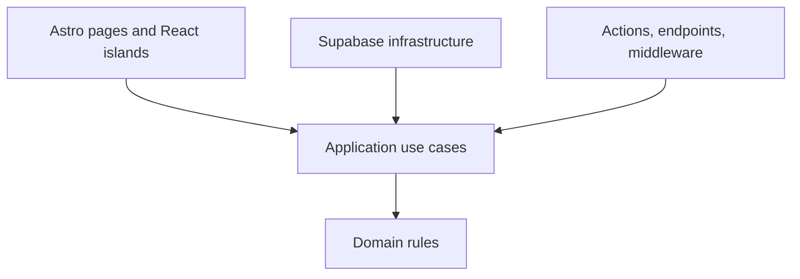

# Modules and Code Organization

Operational rules: @AGENTS.md.

## Business Module Boundaries

### `auth`

Owns identity and session concerns:

- registration;
- magic-link or configured OAuth sign-in;
- logout;
- OAuth/auth callbacks;
- cookie-backed session management;
- resolving the current authenticated actor.

It does not own public profiles. Introduce a `users` module only when the PRD adds profile fields or behavior beyond `auth.users` identity (e.g. display name, avatar, public profile page).

### `builds`

Owns the authoring lifecycle and Build aggregate:

- draft creation;
- author-only editing and deletion;
- the one-way publish transition;
- watch attributes;
- main image reference;
- story;
- ordered parts with category, name, optional product URL, and optional manual price/currency.

The Build aggregate is the consistency boundary for its parts and publication state.

### `catalog`

Owns public read behavior:

- the published-build list;
- the public details read model;
- watch style, movement, dial colour, strap type, and case size filters;
- empty filter results.

`catalog` is intentionally read-oriented. It may query projections from the same PostgreSQL schema but must always apply published visibility. It does not own build mutation rules. Read-model rules: @docs/architecture/data-model.md#catalog-query-model.

### `likes`

Owns engagement with published builds:

- like;
- unlike;
- one-like-per-user uniqueness;
- public like count.

Likes do not affect catalog ordering in the MVP.

### Route compositions are not domains

The account area is a route-level composition:

- `auth` supplies the current actor;
- `builds` supplies that actor's drafts and published builds.

Create an `account` module only when it owns ≥1 use case not composable from `auth` + `builds` (e.g. billing, team membership).

Similarly, `list`, `details`, `editor`, `form`, and `modal` are presentation slices inside modules, not top-level domains.

## Dependency and Export Rules

Allowed direction:

```text
presentation -> application -> domain
                       ^
                       |
                infrastructure
```

Pages, Actions, endpoints, and middleware compose implementations.

Each module can expose `index.ts` (browser-safe types and presentation exports) and `server.ts` (server-side queries, commands, and Actions).

Cross-module imports use public entrypoints only (`@/modules/<name>` and `@/modules/<name>/server`). Do not import from `@/modules/*/infrastructure/*` outside the owning module. Circular imports are prohibited.

## Architectural Style

Organize by business module first (above), then by layer inside each module (below). The mermaid diagram shows allowed dependency direction.



Add aggregates, ports, value objects, and domain errors only when a module has ≥2 infrastructure implementations or a Vitest fake is required for the use case.

## Target Source Structure

Follow module boundaries above. Each module uses the layer layout below (`domain/`, `application/`, `infrastructure/`, `presentation/`, `server.ts`, `index.ts`). Shared kernel: @src/lib/, @src/components/ui/, @src/types.ts. Routes stay thin under `src/pages/`. Migrations: `supabase/migrations/`. Integration and E2E tests: `tests/integration/`, `tests/e2e/`.

Split into `domain/`, `application/`, etc. only after the module has ≥2 files in that layer. Do not create empty directories in advance.

## Module Layer Responsibilities

### Domain

Contains framework-independent business rules for the owning module. For `builds`, examples include Build status, publication eligibility, ownership decisions, and part-price invariants.

Domain code must not import React, Astro, Supabase, HTTP, cookies, Storage, browser APIs, or infrastructure.

### Application

Contains use cases and orchestration:

- `createDraftBuild`;
- `updateBuild`;
- `publishBuild`;
- `deleteBuild`;
- `listOwnedBuilds`;
- `listPublishedBuilds`;
- `getPublicBuildDetails`;
- `likeBuild`;
- `unlikeBuild`.

Application code receives explicit input and an authenticated actor where required. It coordinates domain rules and dependencies but does not know Astro request objects or a concrete Supabase client.

Interfaces belong in `application/ports` only when the use case is tested with a fake and has ≥2 call sites. Do not add one interface per function mechanically.

### Infrastructure

Contains technical implementations:

- Supabase queries and mutations;
- application port implementations;
- Storage operations;
- database-row mapping;
- external service adapters.

Generated database types and raw Supabase response shapes stay at this boundary. Map them into domain models or explicit catalog/account read models.

### Presentation

Presentation owns UI state and formatting only; authorization lives in application code and RLS (@docs/architecture/security.md). Shared, domain-free primitives remain in `src/components/ui`; feature components remain in their module.

### Server

Contains Worker-only entrypoints and composition:

- grouped Astro Actions;
- server-side use-case factories;
- request-bound adapters;
- server-only public exports.

Any file importing `astro:env/server`, privileged credentials, Cloudflare bindings, or server-only Astro APIs must stay out of browser-safe entrypoints.
